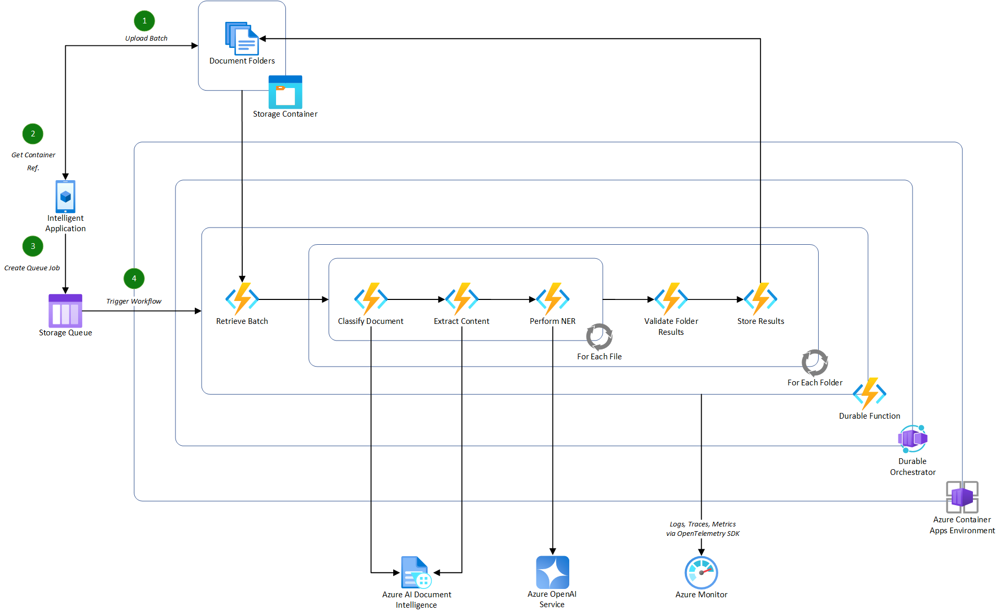
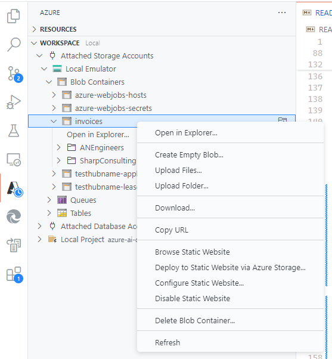

# Azure AI Document Data Extraction Pipeline using Durable Functions (Python)

This sample project demonstrates how to build a scalable, document data extraction pipeline by combining the capabilities of Durable Functions with various techniques for extraction using Azure AI services. The sample specifically processes structured invoices in PDF format. The sample can be adapted to process any structured or unstructured document format.

This approach takes advantage of the following techniques for document data extraction:

- [Using Azure OpenAI GPT-4o to extract structured JSON data from PDF documents by converting them to images](https://github.com/Azure-Samples/azure-openai-gpt-4-vision-pdf-extraction-sample)

## Pre-requisites - Understanding

Before continuing with this sample, please ensure that you have a level of understanding of the following:

### Python Pipeline Specific

- [Durable Functions](https://learn.microsoft.com/en-us/azure/azure-functions/durable/durable-functions-overview?tabs=in-process%2Cnodejs-v3%2Cv1-model&pivots=python)
- [Using Blueprints in Azure Functions for modular components](https://learn.microsoft.com/en-gb/azure/azure-functions/functions-reference-python?tabs=get-started%2Casgi%2Capplication-level&pivots=python-mode-decorators#blueprints)
- [Azure Functions as Containers](https://learn.microsoft.com/en-us/azure/azure-functions/functions-deploy-container-apps?tabs=acr%2Cbash&pivots=programming-language-python)

### Azure Services

- [Azure AI Services](https://learn.microsoft.com/en-us/azure/ai-services/what-are-ai-services)
- [Azure Blob Storage](https://learn.microsoft.com/en-us/azure/storage/blobs/storage-blobs-introduction)
- [Azure Storage Queues](https://learn.microsoft.com/en-us/azure/storage/queues/storage-queues-introduction)
- [Azure Container Apps](https://learn.microsoft.com/en-us/azure/azure-functions/functions-deploy-container-apps?tabs=acr%2Cbash&pivots=programming-language-csharp)

## Pre-requisites - Setup

The sample repository comes with a [**Dev Container**](https://code.visualstudio.com/docs/remote/containers) that contains all the necessary tools and dependencies to run the sample. To use the Dev Container, you need to have the following tools installed on your local machine:

- Install [**Visual Studio Code**](https://code.visualstudio.com/download)
- Install [**Docker Desktop**](https://www.docker.com/products/docker-desktop)
- Install [**Remote - Containers**](https://marketplace.visualstudio.com/items?itemName=ms-vscode-remote.remote-containers) extension for Visual Studio Code

Additionally, you will require:

- An Azure subscription. If you don't have an Azure subscription, create an [account](https://azure.microsoft.com/en-us/).

## Understanding the pipeline

The purpose of this sample is to provide a demonstration of how to effectively build stateful orchestration workflows for batch processing documents, that are stored in an Azure Storage blob container, using a queue (managed by Azure Storage queues in this example).

Below is an illustration of how the pipeline may integrate into an intelligent application consuming it in a potential real-world scenario.



> [!IMPORTANT]
> This illustration contains additional actions that are not covered in this sample project. The implementation provided focuses on the Durable Function element of the pipeline, excluding the classification of documents. For this sample project, it is assumed that all documents are invoices so classification is not required.

### Azure Components

- [**Azure Container Apps**](https://learn.microsoft.com/en-us/azure/azure-functions/functions-deploy-container-apps?tabs=acr%2Cbash&pivots=programming-language-csharp), used to host the containerized functions used in the document processing pipeline.
  - **Note**: By containerizing the functions app, you can integrate this specific orchestration pipeline into an existing microservices architecture or deploy it as a standalone service.
- [**Azure AI Services**](https://learn.microsoft.com/en-us/azure/ai-services/what-are-ai-services), a managed service for all Azure AI Services, including Azure OpenAI, deploying the latest GPT-4o model to support vision-based extraction techniques.
  - **Note**: The GPT-4o model is not available in all Azure OpenAI regions. For more information, see the [Azure OpenAI Service documentation](https://learn.microsoft.com/en-us/azure/ai-services/openai/concepts/models#standard-deployment-model-availability).
- [**Azure Storage Account**](https://learn.microsoft.com/en-us/azure/storage/common/storage-introduction), used to store the batch of documents to be processed and the extracted data from the documents. The storage account is also used to store the queue messages for the document processing pipeline.
- [**Azure Monitor**](https://learn.microsoft.com/en-us/azure/azure-monitor/overview), used to store logs and traces from the document processing pipeline for monitoring and troubleshooting purposes.
- [**Azure Container Registry**](https://learn.microsoft.com/en-us/azure/container-registry/container-registry-intro), used to store the container images for the document processing pipeline service that will be consumed by Azure Container Apps.
- [**Azure User-Assigned Managed Identity**](https://learn.microsoft.com/en-us/entra/identity/managed-identities-azure-resources/overview-for-developers?tabs=portal%2Cdotnet), used to authenticate the service deployed in the Azure Container Apps environment to securely access other Azure services without key-based authentication, including the Azure Storage account and Azure OpenAI service.
- [**Azure Bicep**](https://learn.microsoft.com/en-us/azure/azure-resource-manager/bicep/overview?tabs=bicep), used to create a repeatable infrastructure deployment for the Azure resources.

### Project Structure

The project is structured as follows:

- **[AIDocumentPipeline](./src/AIDocumentPipeline/)**: The main project containing the Durable Functions implementation for the document processing pipeline.
  - **[Invoices](./src/AIDocumentPipeline/invoices/)**: Contains the specific workflows and activities used for processing invoices.
    - Workflows are orchestrations in Durable Functions that manage the execution of activities. They are long-running and stateful.
    - Activities are the individual discrete actions that are executed by the orchestration to process the documents. State is maintained across activities by the Durable Functions runtime.
  - **[Shared](./src/AIDocumentPipeline/shared/)**: Contains specific shared components that are exclusive to the Durable Functions project, including service classes for abstracting the data extraction, and Azure Storage account interactions.
    - **[Documents](./src/AIDocumentPipeline/shared/documents)**: Contains the document data extractor services for Azure OpenAI.

### Flow

The sample pipeline is implemented using Durable Functions and consists of the following steps:

- Upload a batch of documents to an Azure Storage blob container.
- Once the documents are uploaded, send a message to the Azure Storage queue containing the container reference to trigger the document processing pipeline.
- The **[Process Invoice Batch workflow](./src/AIDocumentPipeline/invoices/process_invoice_batch_workflow.py)** picks up the message from the queue and starts to process the request.
- Firstly, the batch document folders are retrieved from the blob container using the container reference in the message. **See [Get Invoice Folders](./src/AIDocumentPipeline/invoices/activities/get_invoice_folders.py).**
  - _Authentication to the Azure Storage account is established via a user-assigned managed identity when deployed in Azure_.
- The initial workflow then triggers the specific invoice data extraction workflow for each document folder in the batch in parallel using the **[Extract Invoice Data workflow](./src/AIDocumentPipeline/invoices/extract_invoice_data_workflow.py)**. These process the folders as follows:
  - For each folder in the batch:
    - For each file in the folder:
      - Extract the content of the file using the document data extractor service, [Azure OpenAI with Vision](./src/AIDocumentPipeline/shared/documents/document_data_extractor.py).
      - Extract the structured data expected for the invoice using the defined [Invoice Data object](./src/AIDocumentPipeline/invoices/invoice_data.py). **See [Extract Invoice Data](./src/AIDocumentPipeline/invoices/activities/extract_invoice_data.py).**
        - _By using a defined data-transfer object, the prompt to the language model can be strictly controlled by providing a schema of the expected data to ensure accurate extraction_.

## Run the sample

The sample project is designed to be deployed as a containerized application using Azure Container Apps. The deployment is defined using Azure Bicep in the [infra folder](./infra/).

The deployment is split into two parts, run by separate PowerShell scripts using the [Azure CLI](https://docs.microsoft.com/en-us/cli/azure/install-azure-cli):

- **[Core Infrastructure](./infra/main.bicep)**: Deploys all of the necessary core components that are required for the document processing pipeline, including the Azure AI services, Azure Storage account, Azure Container Registry, and Azure Container Apps environment. See [Deploy Core Infrastructure PowerShell script](./infra/Deploy-Infrastructure.ps1) for more detail on the infrastructure deployment process.
- **[Application Deployment](./infra/apps/AIDocumentPipeline/app.bicep)**: Deploys the containerized application to the Azure Container Apps environment. See [Deploy App PowerShell script](./infra/apps/AIDocumentPipeline/Deploy-App.ps1) for more detail on the containerization and deployment process.

### Setup the local environment

To setup an environment locally, simply run the [Setup-Environment.ps1](./Setup-Environment.ps1) script from the root of the project:

> [!IMPORTANT]
> Docker Desktop must be running to setup the necessary local development environment.

```powershell
.\Setup-Environment.ps1 -DeploymentName <DeploymentName> -Location <Location> -IsLocal $true -SkipInfrastructure $false
```

> [!NOTE]
> The `-IsLocal` parameter is used to determine whether the complete containerized deployment is made in Azure, or whether to deploy the necessary components to Azure that will support a local development environment. The `-SkipInfrastructure` parameter is used to skip the deployment of the core infrastructure components if they are already deployed.

When configured for local development, you will be granted the following role-based access to your identity scoped to the specific Azure resources:

- **Azure Container Registry**:
  - **Role**: AcrPull
  - **Role**: AcrPush
- **Azure Storage Account**:
  - **Role**: Storage Account Contributor
  - **Role**: Storage Blob Data Contributor
  - **Role**: Storage File Data Privileged Contributor
  - **Role**: Storage Table Data Contributor
  - **Role**: Storage Queue Data Contributor
- **Azure Key Vault**:
  - **Role**: Key Vault Administrator
- **Azure OpenAI Service**:
  - **Role**: Cognitive Services Contributor
  - **Role**: Cognitive Services OpenAI Contributor
- **Azure AI Hub/Project**:
  - **Role**: Azure ML Data Scientist

With the local development environment setup, you can open the solution in Visual Studio Code using the Dev Container. The Dev Container contains all the necessary tools and dependencies to run the sample project with F5 debugging support.

### Setup the complete Azure environment

To setup an environment in Azure, simply run the [Setup-Environment.ps1](./Setup-Environment.ps1) script from the root of the project:

```powershell
.\Setup-Environment.ps1 -DeploymentName <DeploymentName> -Location <Location> -IsLocal $false -SkipInfrastructure $false
```

> [!NOTE]
> The `-IsLocal` parameter is used to determine whether the complete containerized deployment is made in Azure, or whether to deploy the necessary components to Azure that will support a local development environment. The `-SkipInfrastructure` parameter is used to skip the deployment of the core infrastructure components if they are already deployed.

### Running the document processing pipeline

Once an environment is setup, you can run the document processing pipeline by uploading a batch of documents to the Azure Storage blob container and sending a message via a HTTP request or Azure Storage queue containing the container reference.

A batch of invoices is provided in the tests [Invoice Batch folder](./tests/InvoiceBatch/) which can be uploaded into an Azure Storage blob container, locally via Azurite, or in the deployed Azure Storage account.

These files can be uploaded using the Azure VS Code extension or the Azure Storage Explorer.



> [!NOTE]
> Upload all of the individual folders into the container, not the individual files. This sample processed a container that contains multiple folders, each representing a customer's data to be processed which may contain one or more invoices.

#### Via the HTTP trigger

To send via HTTP, open the [`tests/HttpTrigger.rest`](./tests/HttpTrigger.rest) file and use the request to trigger the pipeline.

```http
POST http://localhost:7071/api/invoices
Content-Type: application/json

{
    "container_name": "invoices"
}
```

To run in Azure, replace `http://localhost:7071` with the `containerAppInfo.value.url` value from the [`./infra/apps/AIDocumentPipeline/AppOutputs.json`](./infra/apps/AIDocumentPipeline/AppOutputs.json) file after deployment.

#### Via the Azure Storage queue

To send via the Azure Storage queue, run the [`tests/QueueTrigger.ps1`](./tests/QueueTrigger.ps1) PowerShell script to trigger the pipeline.

This will add the following message to the **invoices** queue in the Azure Storage account, Base64 encoded:

```json
{
  "container_name": "invoices"
}
```

To run in Azure, replace the `az storage message put` command with the following:

```powershell
az storage message put `
    --content $Base64EncodedMessage `
    --queue-name "invoices" `
    --account-name "<storage-account-name>" `
    --auth-mode login `
    --time-to-live 86400
```

The `--account-name` parameter should be replaced with the name of the Azure Storage account deployed in the environment found in the `storageAccountInfo.value.name` value from the [`./infra/InfrastructureOutputs.json`](./infra/InfrastructureOutputs.json) file after deployment.
